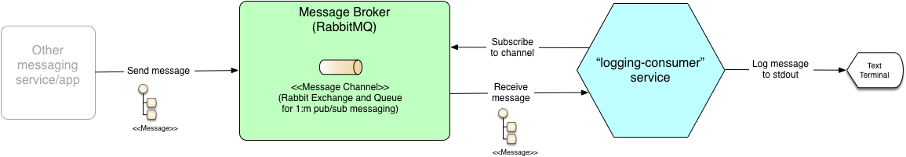
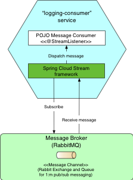

= Logging Consumer Example Messaging Service
:sectlinks:
:sectnums:
:sectnumlevels: 4
:toclevels: 4

== Purpose
This project provides a minimal example of a message-driven service (one that uses async messaging APIs to integrate
with other services on top of a shared message broker) that's built using the Spring Cloud Stream (SCSt) messaging
framework. It serves to provide examples of the following -

1. How to implement a (Java) project for building, testing and packaging a basic SCSt based app, including the
essential plugins, dependencies (libraries) and their versions.
1. How to declare the implementation of  the shared message broker  the service utilises by adding one of SCSt's
supported broker-specific binders to  the application classpath.
1. How to declare a binding to a named input message channel on the shared message broker using SCSt's @EnableBinding
class annotation. (SCSt automatically provisions the message channels specified in bindings on the underlying
broker if they  don't already exist, in a broker-specific manner).
1. How to use SCSt's @StreamListener method annotation to implement a POJO based message consumer that declares
(registers) a handler method for messages that SCSt receives on a specified input message channel, and dispatches to
the method, including binding and converting (deserialising and mapping) the message payload to a type-safe method
param.
1. How to write _efficient_ (simple and quick to run) automated _integration_ tests of application messaging
components (e.g.  message consumers) with the supporting SCSt framework to test correct config of framework
provided features (such as broker binders, channel bindings, @StreamListener methods etc), by using SCSt's testing
support (TestSupportBinder) to avoid the need for such tests to depend on connecting to a real broker.

== Application Overview
The project consists of a single service named 'logging-consumer' that consumes messages received in an input message
channel and processes them by simply logging them to its console (stdout).

As shown in figure 1 below the service exchanges messages with other services indirectly via a message broker for
higher availability and looser coupling. For the purposes of this example RabbitMQ is used as the broker.

.Service consumes messages via a message broker


As shown in figure 2, the service is built on the Spring Cloud Stream (SCSt) framework. This abstracts the service from
the specifics of the particular message broker being used.  The application just adds the class of SCSt binder for the
required broker, in this case RabbitMQ, to its classpath. It also declares SCSt bindings for the message channels it
uses, in this case a single 'input' message channel.

.Service is built on Spring Cloud Stream



SCSt takes care of integrating with the specific broker, including provisioning and subscribing to message channels
declared in the application's bindings; consuming messages from the channel and dispatching them for processing by
the service's declared @StreamListener handler method

== Generating IDE Projects and Code Docs (Javadoc)
If you'd like to view the source and/or run the project's tests from your IDE, the project's Gradle build script
supports generating IDE project files for both Eclipse and IntelliJ IDEA.

To generate an Eclipse project use the following command:

`./gradlew cleanEclipse eclipse`

To generate an IntelliJ IDEA project use the following command:

`./gradlew cleanIdea idea`

To generate the Javadoc for the production code, use the following command:

`./gradlew clean javadoc`

The generated Javadoc can be found in the standard location for a Gradle project - build/docs/javadoc/index.html.

To generate the Javadoc for the test code, use the following command:

`./gradlew clean javadocTests`

The generated Javadoc can be found in the standard location for a Gradle project - build/docs/javadocTests/index.html.

For more details of Gradle build support see build.gradle in the project's root folder.

== Code Overview
The service is written in Java. The source code, and its automated tests can be found in the standard folders
- src/main/java and src/test/java respectively.

The main 'production' classes of interest for this example are -

* `Application` - A typical `@SpringBootApplication` class which has additionally been annotated `@EnableBinding` to
enable the SCSt magic which includes declaring the messaging channels to be bound (resolved and created) on the
underlying broker, and enabling the Spring Integration infrastructure beans that SCSt builds on.
* `PersonMessageConsumer` - A Spring managed POJO based message consumer bean implemented using SCSt. Uses the
`@StreamListener` annotation to register a handler  method  with  SCSt to consume messages received on a specified input message
channel.

Automated tests are written using JUnit (5). They include  -

* `PersonMessageConsumerSpringIntegrationTest` -  A narrow set of integration tests that launch the Spring container to
test the integration of the `PersonMessageConsumer` bean with the SCSt messaging framework. See the class' Javadoc
for more details including the extent of test coverage it provides.

== Building & Running the Automated Tests
You will need to install a Java 11 JDK.

A Gradle build script is provided to support building and running the app and its automated tests, as well as
packaging the app for deploying and running standalone.

The minimum required version of Gradle will be installed when you execute the build using the supplied Gradle wrapper script (./gradlew).

*Note* - For speed and simplicity all of the application's tests, including the aforementioned SCSt integration tests
do _not_ rely on connecting to the message broker. You  can therefore execute them without needing to install and
run a local instance of RabbitMQ.

To compile and run all the automated tests from the command line, enter the following command in the project's root
folder:

`./gradlew clean test`

== End-to-end Testing
This section contains outline instructions on how to perform an  end-to-end test of the message consumer in conjunction
with a locally running instance of the real (RabbitMQ) message broker.

*1)* Launch an instance of the RabbitMQ broker in a background process listening on localhost default port (55672)
using the following cmd -
```bash
$RABBITMQ_HOME/sbin/rabbitmq-server -detached
```
where $RABBITMQ_HOME is an env variable pointing to the directory in which you installed RabbitMQ, e.g.
/usr/local/opt/rabbitmq.

*2)* To support deploying & running the app standalone from any location, assemble (compile and package) it into
an executable JAR file using the following command -
```bash
./gradlew assemble
```

*3)* Run the application from its assembled JAR in a background process attached to your shell by entering the
following command e.g.
```bash
java -jar ./build/libs/logging-consumer-0.0.1-snapshot.jar &
```

A fuller example of the command is -
```bash
java -jar ./build/libs/logging-consumer-{version}.jar [--spring.profiles.active=local] &
```

where

* `{version}` is the project version, e.g. 0.0.1-snapshot.
* `spring.profiles.active` is an optional option used to select the Spring bean profiles which should be activated.
This defaults to 'local' - the base profile for a local dev environment. For more details see the comments in  the
service's application config file - src/main/resources/application.yaml.

If the app starts up successfully you will see a line similar to the following line output to console -
```
...
2019-12-23 13:45:04.254  INFO 29406 --- [           main] c.n.e.scst.loggingconsumer.Application   : Started Application in 3.428 seconds (JVM running for 4.056)
```

*4)* Use a RabbitMQ client to publish (send) a message with a payload containing a valid (JSON) representation of a
Person to the input message channel on which the message consumer is listening. For example, use the `rabbitmqadmin`
command line tool by entering the following command -
```bash
$RABBITMQ_HOME\rabbitmqadmin publish exchange=input routing_key=test payload="{\"firstName\":\"Joe\",
\"lastName\":\"Bloggs\"}"
```

(For examples of more commands that can be entered using the rabbitmqadmin client see
https://www.rabbitmq.com/management-cli.html).

Alternatively you can use the RabbitMQ web admin console by entering the following URL in your browser
http://localhost:15672/#/exchanges/%2F/input to display the page for the RabbitMQ Exchange (message destination)
named 'input'. Then use the 'Publish message' form on this page to enter and publish the message.

*5)* If the published message is successfully processed the app's message consumer will log a message similar to the
following to the console  -
```bash
2019-12-23 13:45:09.266  INFO 29406 --- [onsumer-group-1] c.n.e.s.l.PersonMessageConsumer          : Received person [Person{firstName='Joe', lastName='Bloggs'}].
```

*6)* Clean-up by entering the following command to shutdown the application
```bash
kill $(ps aux | grep '[l]ogging-consumer' | awk '{print $2}')
```
And the following command to shutdown the message broker
```bash
rabbitmqctl shutdown
```

End

---